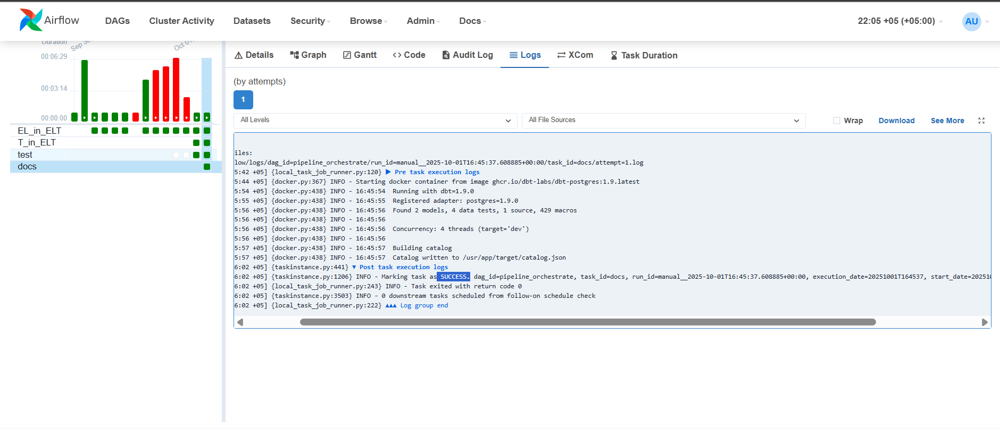

#Mini-Pipeline Project

Это мой первый проект мини-пайплайн построенный на Airflow, dbt, docker compose и Postgres

Все запускалось с чистого WSL-Ubuntu, проект построен на контейнерах docker-compose

все нужные библиотеки указаны в requirement.txt

#Архитектура проекта

AWS S3 >> Python-s3fs >> Airflow >> Postgres >> dbt

#Архитектура БД

1.  Data Lakehouse - Полностью сырые данные
2.  Silver Layer - Частично обработанные данные с нецелостными строками, но готовые для анализа
3.  Gold Layer - Полностью очищенные данные 

#Стек технологий 
    - Python
    - Airflow 2.9.3
    - PostgreSQL
    - Docker Compose 
    - AWS S3
    - dbt

#Примеры работающего Airflow

